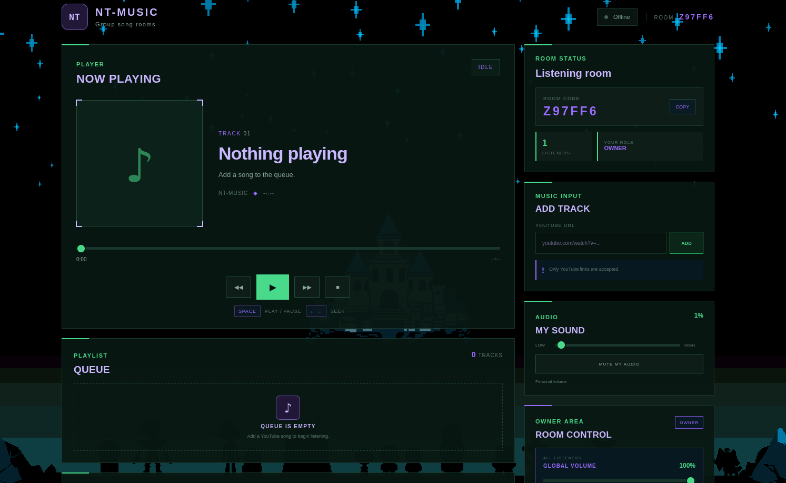

# NT-MUSIC

NT-MUSIC is a small shared music room application.

The idea is simple: people join the same room and listen to music together. The room owner controls playback, while DJs can also control playback and add songs. Songs are added using YouTube links.



## How it works

- Create a room and share the room code.
- Other users join using the code.
- The owner can play, pause, stop, seek, and skip songs.
- The owner can give another user DJ permissions.
- Owners and DJs can add YouTube songs to the queue.
- Each user has their own volume control.
- The owner can also control the global music volume and mute everyone.
- Listening history is kept for the current room.
- The frontend includes a simple audio visualizer that reacts to the playing audio.

## Project structure

```text
NT-MUSIC/
├── client/
│   ├── frontend/
│   │   ├── app.js
│   │   ├── index.html
│   │   ├── style.css
│   │   └── nt-music-background.png
│   │
│   ├── main.go
│   ├── player.go
│   ├── protocol.go
│   ├── room.go
│   ├── websocket.go
│   ├── playback_sync_test.go
│   ├── room_join_test.go
│   ├── room_test.go
│   ├── websocket_test.go
│   ├── go.mod
│   ├── go.sum
│   └── package-lock.json
│
├── server/
│   ├── main.go
│   ├── websocket.go
│   ├── protocol.go
│   ├── room.go
│   ├── room_playback.go
│   ├── playback.go
│   ├── queue.go
│   ├── history.go
│   ├── permissions.go
│   ├── volume.go
│   ├── song.go
│   ├── song_metadata.go
│   ├── youtube.go
│   ├── audio_proxy.go
│   │
│   ├── permissions_test.go
│   ├── playback_queue_test.go
│   ├── playback_test.go
│   ├── protocol_test.go
│   ├── queue_progression_test.go
│   ├── queue_remove_current_playback_test.go
│   ├── queue_remove_current_test.go
│   ├── queue_remove_middle_test.go
│   ├── queue_remove_playback_test.go
│   ├── queue_test.go
│   ├── room_controller_init_test.go
│   ├── room_playback_add_during_play_test.go
│   ├── room_playback_controller_test.go
│   ├── room_playback_duration_test.go
│   ├── room_playback_last_song_test.go
│   ├── room_playback_order_test.go
│   ├── room_playback_test.go
│   ├── room_test.go
│   ├── song_test.go
│   ├── websocket_test.go
│   ├── youtube_test.go
│   │
│   ├── security/
│   │   ├── abuse.go
│   │   ├── identity.go
│   │   ├── input_limits.go
│   │   ├── origin.go
│   │   ├── rate_limiter.go
│   │   ├── room_access.go
│   │   ├── validation.go
│   │   ├── websocket.go
│   │   ├── abuse_test.go
│   │   ├── identity_test.go
│   │   ├── origin_test.go
│   │   ├── rate_limiter_test.go
│   │   ├── room_access_test.go
│   │   ├── security_test.go
│   │   └── websocket_test.go
│   │
│   ├── go.mod
│   └── go.sum
│
├── shared/
│   └── protocol.go
│
├── Dockerfile
├── README.md
└── .gitignore

```
# license

ISC

